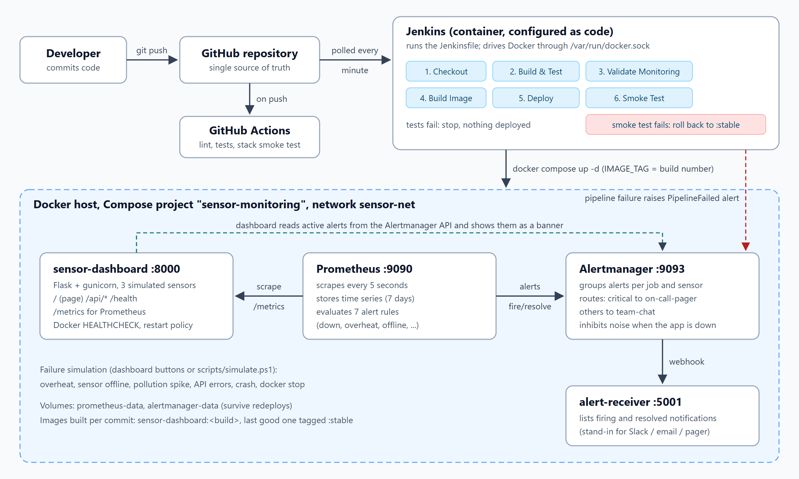
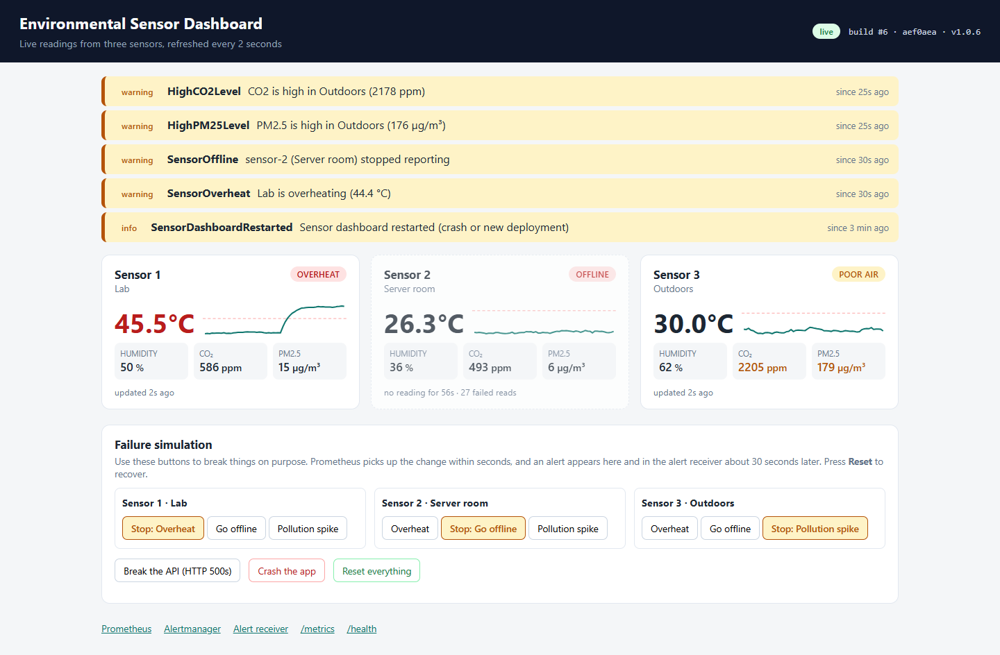
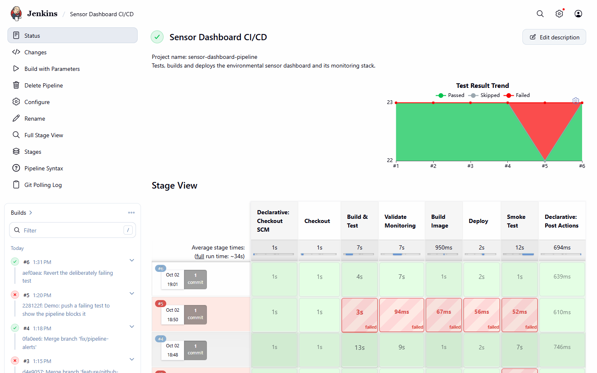
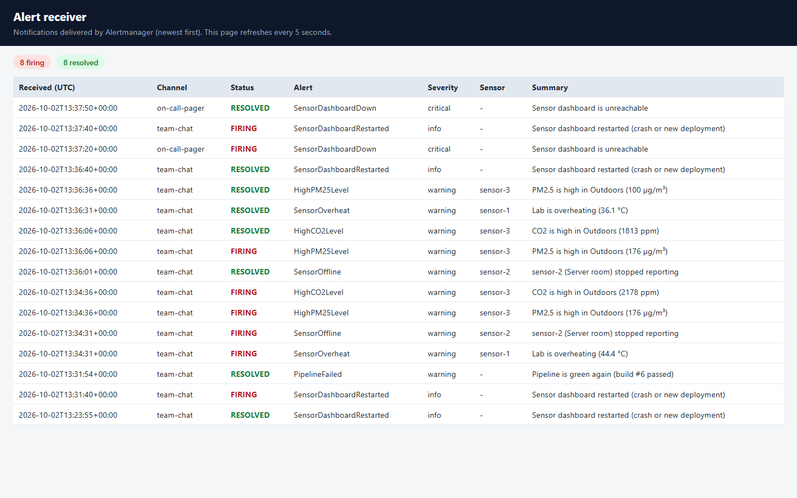
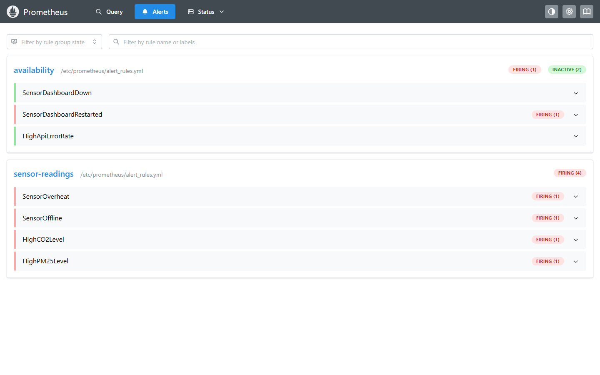

# Automated CI/CD and Real-Time Failure Monitoring of a Containerized Environmental Sensor Dashboard

A small web app that shows live readings from three environmental sensors, plus
everything around it that a real team would need: a Jenkins pipeline that tests,
builds and deploys every commit (and rolls back a bad release on its own), and a
Prometheus + Alertmanager setup that notices when something breaks and tells
someone about it.

The sensor data is simulated. The point of the project is the delivery pipeline
and the monitoring, not the hardware.



## The loop in one paragraph

You push to GitHub. Jenkins notices the new commit within a minute and runs the
`Jenkinsfile`: the unit tests run inside a Docker container, the alert rules are
checked, a new image is built and deployed with Docker Compose, and a smoke test
checks the new container. If the tests fail, nothing is deployed. If the smoke
test fails, Jenkins puts the previous good image back. Meanwhile Prometheus
scrapes the app every 5 seconds; when a rule like "app unreachable for 30
seconds" or "temperature above 35 °C" holds, Alertmanager groups the alert and
sends it to the alert receiver. When the problem goes away the alert is marked
resolved.

## What's in the repo

| Path | What it is |
|---|---|
| `app/` | Flask dashboard (`sensor_dashboard/`), unit tests, multi-stage `Dockerfile` |
| `monitoring/prometheus/` | Scrape config, 7 alert rules, and promtool unit tests for those rules |
| `monitoring/alertmanager/` | Routing (critical → on-call, the rest → team chat), grouping, inhibition |
| `monitoring/alert-receiver/` | Tiny webhook service that shows the notifications Alertmanager sends |
| `docker-compose.yml` | The running system: dashboard, Prometheus, Alertmanager, alert receiver |
| `Jenkinsfile` | The CI/CD pipeline |
| `jenkins/` | Jenkins image with Docker CLI and plugins, configured as code (`casc.yaml`) |
| `scripts/` | Smoke test, rollback, pipeline-to-Alertmanager notifier, failure simulators |
| `.github/workflows/ci.yml` | GitHub Actions: lint, tests, rule tests, stack smoke test on every push |
| `docs/` | Project report and screenshots |

## Tools used

| Stage of the DevOps loop | Tool |
|---|---|
| Version control | Git, GitHub (feature branches merged into `main`) |
| Build | Docker multi-stage build (Python 3.12, gunicorn) |
| Automated testing | pytest + flake8 (23 tests, ~91% coverage), promtool rule tests, unittest |
| CI/CD | Jenkins (declarative pipeline), GitHub Actions |
| Containerization / deployment | Docker, Docker Compose |
| Monitoring | Prometheus (`prometheus_client` metrics from the app) |
| Alerting | Alertmanager, webhook receiver |

## Running it

You need Docker Desktop (or Docker Engine with the Compose plugin) and Git.

### 1. Start the app and the monitoring stack

```bash
git clone https://github.com/Yashvi2874/DevOps_failure_monitoring.git
cd DevOps_failure_monitoring
docker compose up -d --build
```

| Service | URL |
|---|---|
| Sensor dashboard | http://localhost:8000 |
| Prometheus | http://localhost:9090 (try *Alerts* and *Status → Target health*) |
| Alertmanager | http://localhost:9093 |
| Alert receiver | http://localhost:5001 |

`docker compose ps` should list four containers, with the dashboard and the
receiver marked `healthy` after about 15 seconds.

### 2. Start Jenkins

```bash
cd jenkins
cp .env.example .env      # then set JENKINS_ADMIN_PASSWORD (and JENKINS_PORT if 8080 is taken)
docker compose up -d --build
```

Open http://localhost:8080 (or the port you chose) and log in as `admin`. There
is no setup wizard: `casc.yaml` creates the user and the
`sensor-dashboard-pipeline` job on startup. The first build starts by itself
within a minute; after that every push to `main` triggers a build.

On the machine we demo on, port 8080 is already used by another program, so
our `.env` sets `JENKINS_PORT=8090`.

Jenkins talks to the host's Docker engine through the mounted
`/var/run/docker.sock`, which is how pipeline steps like `docker build` and
`docker compose up` work from inside the Jenkins container.

## The pipeline

| Stage | What happens | If it fails |
|---|---|---|
| Checkout | Pulls the commit, records the short hash and message | — |
| Build & Test | Builds the `test` stage of `app/Dockerfile` and runs flake8 + pytest in a container; the JUnit report is published to Jenkins | Pipeline stops. Nothing is deployed. |
| Validate Monitoring | `promtool check config`, `promtool test rules`, `amtool check-config`, routing checks, receiver tests | Pipeline stops |
| Build Image | Builds `sensor-dashboard:<build number>` with the commit hash baked in | Pipeline stops |
| Deploy | `docker compose up -d` with `IMAGE_TAG=<build number>`; only changed containers are replaced | Pipeline stops |
| Smoke Test | From a container on the same network: `/health` is OK and reports the expected build, the API returns 3 sensors, `/metrics` works, Prometheus sees the new target | `scripts/rollback.sh` redeploys `sensor-dashboard:stable` (the last build that passed) and checks it |

After a successful smoke test the image is tagged `:stable` (used for rollbacks) and
`:latest` (what a plain `docker compose up -d` starts). Whatever the
outcome, the pipeline reports to Alertmanager: a failed build raises a
`PipelineFailed` alert and the next green build resolves it.

Running the job with **Build with Parameters → SIMULATE_BAD_DEPLOY** deploys a
build whose `/health` returns 503, which is an easy way to watch the rollback.

## Alerts

| Alert | Fires when | Severity → channel |
|---|---|---|
| `SensorDashboardDown` | Prometheus can't scrape the app for 30 s | critical → on-call-pager |
| `HighApiErrorRate` | More than 20% of `/api/*` requests return 5xx for 30 s | critical → on-call-pager |
| `SensorDashboardRestarted` | The app process started again in the last 5 min (crash or deploy) | info → team-chat |
| `SensorOverheat` | A sensor reads above 35 °C for 15 s | warning → team-chat |
| `SensorOffline` | A sensor hasn't reported for more than 10 s, for 10 s | warning → team-chat |
| `HighCO2Level` / `HighPM25Level` | CO2 > 1500 ppm / PM2.5 > 100 µg/m³ for 20 s | warning → team-chat |
| `PipelineFailed` | Sent by Jenkins when a build fails | warning → team-chat |

Alertmanager groups alerts by job and sensor, so a pollution spike on Sensor 3
(high CO2 *and* high PM2.5) arrives as one notification. Two inhibition rules
cut noise: while the whole app is down, its warning and info alerts are held
back, and an offline sensor isn't also reported as overheating.

## Breaking things on purpose

The dashboard has a **Failure simulation** panel. The same scenarios are
available from the command line:

```powershell
.\scripts\simulate.ps1 overheat -Sensor sensor-1     # Windows
./scripts/simulate.sh offline sensor-2               # bash
```

| Do this | You should see (timings measured on our setup) |
|---|---|
| Overheat Sensor 1 | `SensorOverheat` in the receiver after ~30–40 s |
| Take Sensor 2 offline | `SensorOffline` after ~30 s |
| Pollution spike on Sensor 3 | `HighCO2Level` + `HighPM25Level` in one notification after ~45 s |
| Break the API (with the dashboard open, so there is traffic) | `HighApiErrorRate` on the on-call channel after ~50 s |
| Crash the app | Docker's restart policy brings it back in seconds; `SensorDashboardRestarted` appears |
| `docker stop sensor-dashboard` | `SensorDashboardDown` after ~45 s; resolves ~25 s after `docker start` |
| Push a commit with a failing test | Jenkins stops at Build & Test, the running version is untouched, `PipelineFailed` fires |
| **Reset everything** | Each alert shows up again as RESOLVED |

## Screenshots

| | |
|---|---|
|  |  |
| Dashboard while three sensors are misbehaving | Jenkins builds: green deploys, a blocked bad test (#5) and a rolled-back release (#3) |
|  |  |
| Notifications on both channels, firing and resolved | Alert rules firing in Prometheus |

More in [`docs/screenshots`](docs/screenshots) and in the [project report](docs/REPORT.md).

## Choices worth explaining

- **Configs are baked into images, not bind-mounted.** Jenkins runs in a
  container and uses the host's Docker engine, so a path like
  `./monitoring/prometheus.yml` inside the Jenkins workspace doesn't exist on
  the host. Copying configs into small custom images avoids that problem and
  means a config change goes through the same build-test-deploy path as code.
- **Polling instead of a GitHub webhook.** A webhook is instant, but GitHub
  can't reach a Jenkins running on a laptop. Polling every minute works
  anywhere.
- **One gunicorn worker with threads.** The simulator and the metrics live in
  memory. Several worker processes would each have their own sensors and
  counters.
- **The tests run in a container.** The Jenkins machine needs nothing but the
  Docker CLI, and tests run on the same Python version as production.
- **Security notes.** Mounting the Docker socket gives Jenkins root-level
  control over the host, which is acceptable on a lab machine but not on a
  shared server. The app and the receiver run as non-root users. Secrets
  (the Jenkins password) live in `jenkins/.env`, which Git ignores.

## Troubleshooting

- **Port already in use.** Change the left side of the port mapping in
  `docker-compose.yml`, or `JENKINS_PORT` in `jenkins/.env`.
- **No alert after a scenario.** Check http://localhost:9090/alerts. *Pending*
  means the `for:` timer is still running. If Prometheus shows it firing but
  the receiver doesn't, look at `docker logs alertmanager`.
- **Avoid restarting Alertmanager in the middle of an incident.** It keeps
  active alerts in memory and remembers what it already sent, so it may skip a
  repeat notification until the alert resolves.
- **Jenkins can't run docker.** On Linux hosts set `DOCKER_GID` in
  `jenkins/.env` to the gid of the `docker` group (`getent group docker`).

## Team

| Name | Roll no. |
|---|---|
| Yashasvi Gupta | 16010123341 |
| Shubhpreet Kaur | 16010123328 |
| Aditi Agarwal | 16010123018 |
