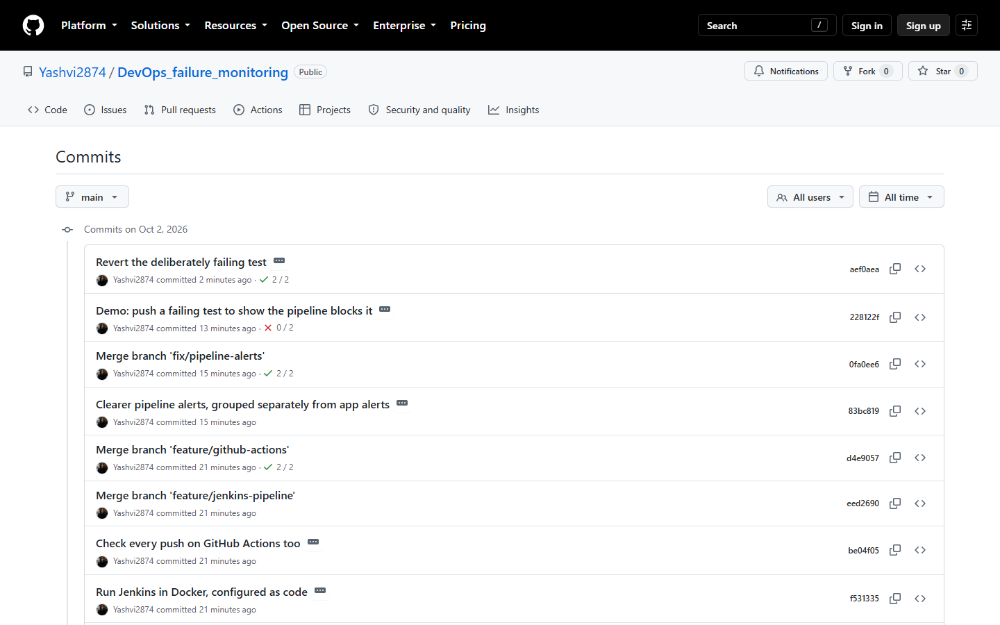
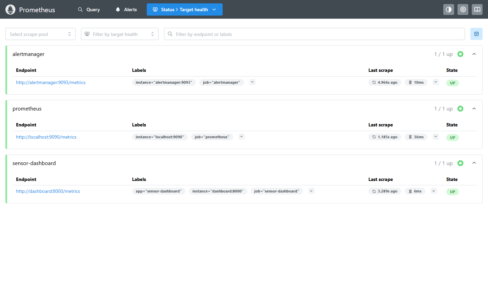
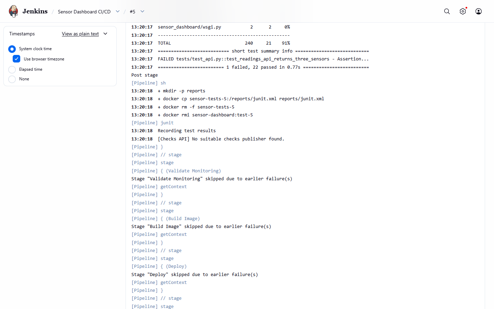
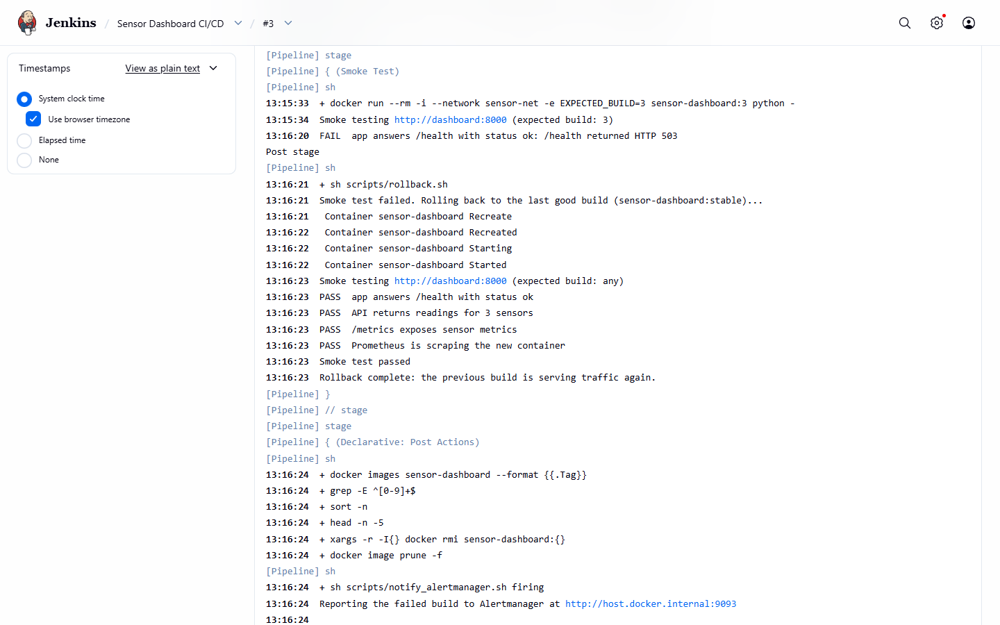
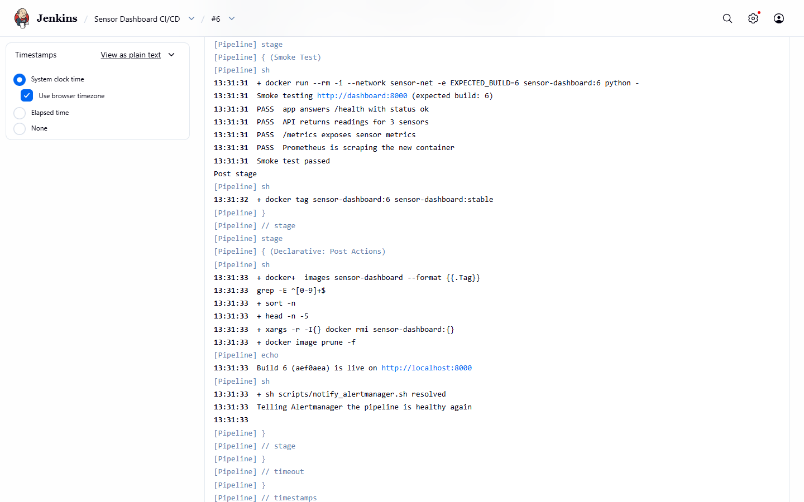
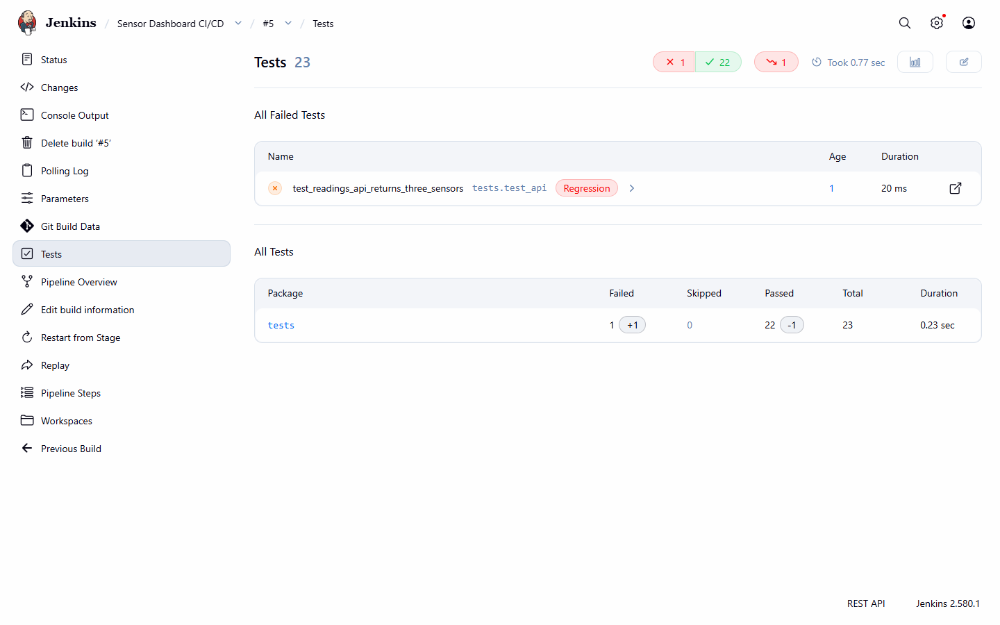
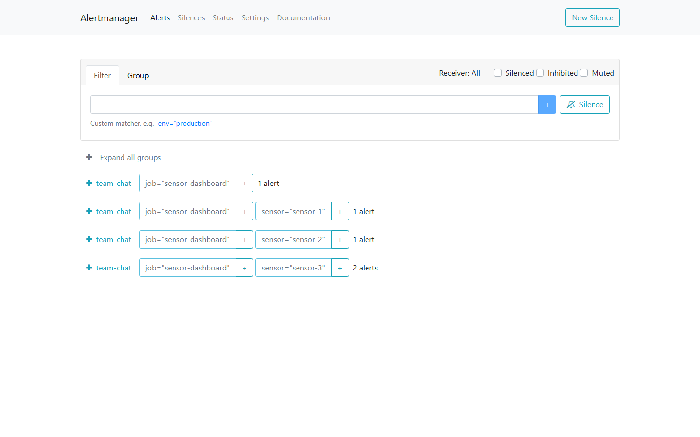
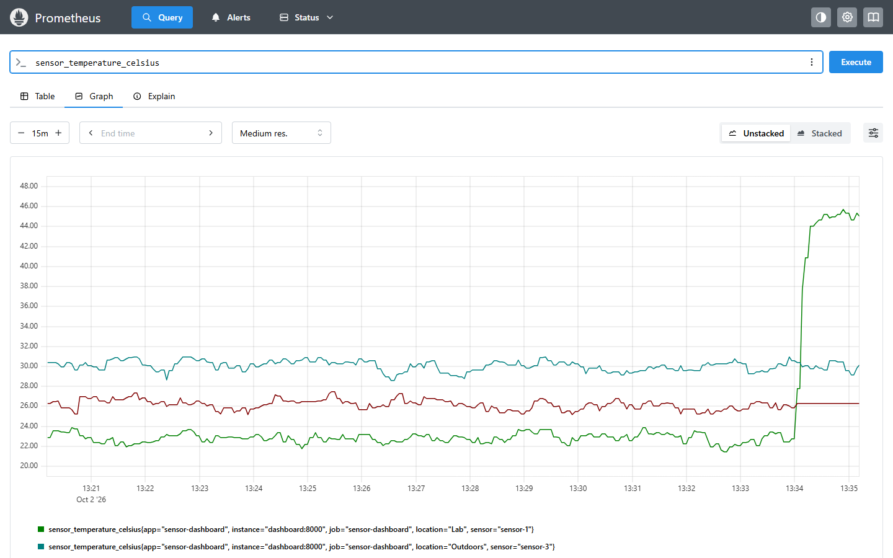
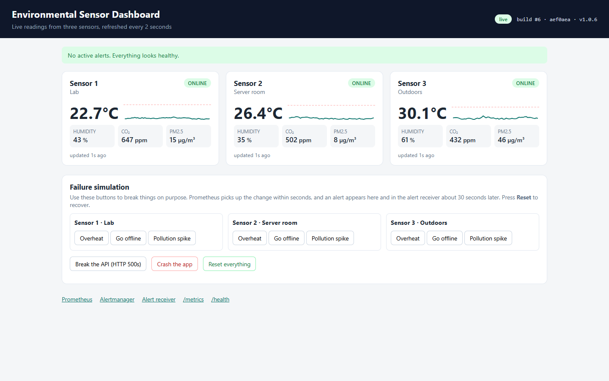

# 1. Abstract

We built a small web application, an environmental sensor dashboard, and then
automated everything that happens to it after a developer commits code. Every
push to GitHub is picked up by Jenkins, which runs the unit tests inside a
Docker container, validates the monitoring configuration, builds a new image,
deploys it with Docker Compose and smoke-tests the result. If the tests fail,
nothing is deployed; if the smoke test fails, the previous working image is
restored automatically. The running system is watched by Prometheus, which
scrapes the application every five seconds and evaluates seven alert rules.
Alertmanager groups, routes and de-duplicates the resulting alerts and delivers
them to a webhook receiver that stands in for Slack or email. Failed pipeline
runs are reported through the same channel. We tested the whole loop with real
failure scenarios: overheating and offline sensors, a pollution spike, an API
returning errors, a crashed process, a stopped container, a commit with a
broken test and a release that fails its health check. In every case the
problem was either blocked before deployment or detected and reported within
about 30 to 50 seconds, and each alert was marked resolved once the problem
was fixed.

Source code: <https://github.com/Yashvi2874/DevOps_failure_monitoring>

# 2. Introduction

## 2.1 Background

A DevOps workflow closes the gap between writing code and running it. Instead
of a person copying files to a server and hoping nothing breaks, the steps
from commit to production are written down as code and run by machines, and
the running system is measured continuously so that problems are found by
monitoring rather than by users.

Our application is deliberately simple: a dashboard that shows temperature,
humidity, CO₂ and PM2.5 readings from three sensors placed in a lab, a server
room and outdoors. The readings are simulated, because the subject of the
project is the delivery pipeline and the monitoring around the app, not the
sensor hardware. A simple app also makes it easy to break things on purpose
and watch how the system reacts.

## 2.2 Problem statement

Without automation, a team faces three recurring problems:

1. **Untested code reaches users.** Someone forgets to run the tests before
   deploying, and a bug goes live.
2. **"It works on my machine."** The app behaves differently on the developer's
   laptop, the tester's machine and the server, because each has different
   library versions.
3. **Failures are noticed late.** A sensor stops reporting or the server room
   overheats, and nobody finds out until someone happens to look.

## 2.3 Objectives

1. Keep all code and configuration in Git, using feature branches.
2. Build the application into a Docker image so it runs identically everywhere.
3. Run automated tests on every change and stop the pipeline if any fail.
4. Deploy automatically with Jenkins, and roll back automatically if the new
   version is unhealthy.
5. Collect metrics from the running app with Prometheus.
6. Define alert rules for application and sensor failures, and deliver alerts
   through Alertmanager with sensible grouping, routing and noise suppression.
7. Demonstrate each failure scenario and measure how long detection takes.

# 3. Tools and technologies

| Area | Tool (version) | Why we used it |
|---|---|---|
| Version control | Git, GitHub | History of every change; Jenkins and GitHub Actions read the code from here |
| Application | Python 3.12, Flask 3.1, gunicorn 23 | Small, readable web stack |
| Metrics library | prometheus_client 0.23 | Exposes app and sensor metrics in Prometheus format |
| Testing | pytest 8.4, pytest-cov, flake8 7.3, promtool, unittest | Unit tests, coverage, lint, and tests for the alert rules themselves |
| Containers | Docker Engine 29, Docker Compose plugin | Packaging and running all five services |
| CI/CD | Jenkins 2.580.1 LTS (declarative pipeline, Configuration as Code, Job DSL) | Automates test → build → deploy → verify |
| CI on GitHub | GitHub Actions | A second, independent check on every push |
| Monitoring | Prometheus 3.13.4 | Pull-based metrics collection and alert rule evaluation |
| Alerting | Alertmanager 0.34.1 | Grouping, routing, inhibition and delivery of alerts |

# 4. System architecture


The system has two halves.

**The delivery half** starts with the developer. Code is pushed to GitHub,
where GitHub Actions runs a quick check and Jenkins picks the change up by
polling the repository every minute. Jenkins itself runs in a Docker container.
It has the Docker command-line tools installed and the host's Docker socket
mounted, so every pipeline step (building images, running tests, starting
containers) is carried out by the host's Docker engine.

**The running half** is a Docker Compose project called `sensor-monitoring`
with four containers on a private network named `sensor-net`:

| Container | Port | Role |
|---|---|---|
| `sensor-dashboard` | 8000 | The Flask app: dashboard page, JSON API, `/health`, `/metrics` |
| `prometheus` | 9090 | Scrapes `/metrics` every 5 s, stores the time series, evaluates alert rules |
| `alertmanager` | 9093 | Receives alerts from Prometheus (and Jenkins), groups and routes them |
| `alert-receiver` | 5001 | Shows every notification Alertmanager delivers |

Containers find each other by service name: Prometheus scrapes
`dashboard:8000`, and the dashboard reads active alerts from
`alertmanager:9093` so it can show them as a banner on the page.

# 5. Implementation

## 5.1 The application

The sensor simulator (`app/sensor_dashboard/sensors.py`) keeps three sensors,
each with its own baseline. On every tick (every two seconds) each value moves
a little towards its baseline plus some random noise, which gives realistic,
slowly drifting readings. Each sensor can be switched into a failure scenario:

- **overheat**: the temperature drifts towards 45 °C;
- **offline**: the sensor stops producing readings and every attempted read
  counts as an error;
- **pollution**: CO₂ and PM2.5 climb towards unhealthy levels.

The Flask app (`app.py`) serves the dashboard page, which refreshes itself
every two seconds, and a small JSON API. Two more endpoints matter for
operations:

- `/health` returns the app's status and the build number that is running. The
  Jenkins smoke test uses the build number to make sure the *new* version is
  the one answering.
- `/metrics` exposes the readings and the app's own behaviour in Prometheus
  format:

| Metric | Meaning |
|---|---|
| `sensor_temperature_celsius`, `sensor_humidity_percent`, `sensor_co2_ppm`, `sensor_pm25_ugm3` | Latest reading per sensor |
| `sensor_last_seen_timestamp_seconds` | When each sensor last reported (used to detect offline sensors) |
| `sensor_up`, `sensor_read_errors_total` | Sensor status and failed reads |
| `dashboard_http_requests_total`, `dashboard_http_request_duration_seconds` | Request count and latency per endpoint and status code |
| `dashboard_build_info` | Which build and commit are running |
| `process_start_time_seconds` | When the process started (used to detect restarts) |

A **failure simulation** panel on the dashboard (and the scripts
`scripts/simulate.ps1` and `simulate.sh`) can trigger each scenario, make the
API return HTTP 500 errors, or crash the app.

## 5.2 Version control workflow

Each feature was developed on its own branch and merged into `main` with a
merge commit, so the history shows where each feature began and ended:
`feature/sensor-simulator`, `feature/dashboard`, `feature/docker`,
`feature/monitoring`, `feature/jenkins-pipeline`, `feature/github-actions`, and
a later `fix/pipeline-alerts`. Secrets such as the Jenkins admin password live
in `jenkins/.env`, which is listed in `.gitignore` and never committed.



## 5.3 Containerization

`app/Dockerfile` is a multi-stage build:

```dockerfile
FROM python:3.12-slim AS base      # Python + runtime libraries
...
FROM base AS test                  # + pytest and flake8; runs the tests when started
...
FROM base AS runtime               # the image that gets deployed
RUN useradd --create-home --uid 10001 appuser
USER appuser
HEALTHCHECK --interval=10s CMD python -c "import urllib.request; urllib.request.urlopen('http://127.0.0.1:8000/health')"
CMD ["gunicorn", "--bind", "0.0.0.0:8000", "--workers", "1", "--threads", "4", "sensor_dashboard.wsgi:app"]
```

The `requirements.txt` file is copied and installed before the source code, so
Docker can reuse the cached dependency layer when only the code changes. The
runtime image runs as a non-root user, and has a health check that Docker uses
to mark the container healthy or unhealthy. The Compose file sets
`restart: unless-stopped`, so a crashed container is started again
automatically.

The Prometheus and Alertmanager configuration files are copied into small
custom images rather than mounted from the host. This was a deliberate choice
(see section 8): it lets Jenkins deploy the stack even though Jenkins runs in
its own container, and it means a change to an alert rule is built, tested and
deployed exactly like a change to the code.

## 5.4 CI/CD pipeline (Jenkins)

The pipeline is defined in the `Jenkinsfile` at the root of the repository:

| Stage | What it does | On failure |
|---|---|---|
| Checkout | Fetches the commit and records its hash and message | — |
| Build & Test | Builds the `test` image and runs flake8 and 23 pytest tests inside a container; publishes the JUnit report | Pipeline stops, nothing is deployed |
| Validate Monitoring | Checks the Prometheus config, runs the alert-rule unit tests, checks the Alertmanager config and its routing, runs the receiver's tests | Pipeline stops |
| Build Image | Builds `sensor-dashboard:<build number>` with the version, commit hash and build number baked in | Pipeline stops |
| Deploy | `docker compose up -d` with `IMAGE_TAG=<build number>`; only containers whose image changed are replaced | Pipeline stops |
| Smoke Test | From a throwaway container on `sensor-net`: `/health` is OK and reports this build, the API returns three sensors, `/metrics` works, and Prometheus is scraping the new container | `rollback.sh` redeploys `sensor-dashboard:stable` and checks it |

When the smoke test passes, the image is also tagged `sensor-dashboard:stable`,
which marks it as the last known good build for future rollbacks. At the end,
the pipeline sends its result to Alertmanager: a failed build raises a
`PipelineFailed` alert and the next successful build resolves it. This way,
broken deployments and broken builds reach the team through the same channel
as application failures.

Jenkins is set up entirely from files in `jenkins/`. The `Dockerfile` adds the
Docker CLI, the Compose plugin and the required Jenkins plugins.
`casc.yaml` (Jenkins Configuration as Code) creates the admin user and, through
the Job DSL plugin, the `sensor-dashboard-pipeline` job, which polls GitHub
every minute. There is no setup wizard. The whole CI server can be rebuilt with
one `docker compose up` command.

GitHub Actions (`.github/workflows/ci.yml`) runs lint, the unit tests, the rule
tests and a full stack smoke test on GitHub's own machines for every push, as
an independent second check.


## 5.5 Monitoring with Prometheus

Prometheus scrapes three targets every five seconds: the dashboard, itself and
Alertmanager. It evaluates the rules in `alert_rules.yml` at the same
interval. Each rule is a PromQL query plus a `for` duration, which means the
condition has to hold for that long before the alert fires. This avoids alerts
for momentary blips.

| Alert | Condition | Severity |
|---|---|---|
| `SensorDashboardDown` | `up == 0` for 30 s | critical |
| `HighApiErrorRate` | more than 20% of `/api/*` requests are 5xx, for 30 s | critical |
| `SensorDashboardRestarted` | `process_start_time_seconds` changed in the last 5 min | info |
| `SensorOverheat` | temperature > 35 °C for 15 s | warning |
| `SensorOffline` | no reading for more than 10 s, for 10 s | warning |
| `HighCO2Level` | CO₂ > 1500 ppm for 20 s | warning |
| `HighPM25Level` | PM2.5 > 100 µg/m³ for 20 s | warning |

The rules have their own unit tests (`monitoring/prometheus/tests/alert_rules_test.yml`),
run with `promtool test rules`. Each test feeds Prometheus a made-up time
series and checks which alerts are firing at a given moment, including the
exact alert text. For example, one test checks that a 10-second outage does
*not* page anyone. We confirmed the tests are real by changing one expected
value and watching the test fail.



## 5.6 Alerting with Alertmanager

Alertmanager decides who hears about an alert, when, and how often:

- **Routing.** Critical alerts go to an `on-call-pager` receiver and are sent
  after 5 seconds; everything else goes to `team-chat`.
- **Grouping.** Alerts are grouped by job and sensor. A pollution spike on
  Sensor 3 raises both `HighCO2Level` and `HighPM25Level`, but they arrive as a
  single notification.
- **Inhibition.** While `SensorDashboardDown` is firing, the app's warning and
  info alerts are held back, because they are symptoms of the same outage. An
  offline sensor's last temperature is stale, so `SensorOffline` also
  suppresses `SensorOverheat` for that sensor.
- **Resolution.** `send_resolved: true` means a second notification is sent
  when a problem clears.

Both receivers are webhooks pointing at our `alert-receiver` service, a
small Python program (standard library only) that stores the notifications
and lists them on a web page. In a real team this would be Slack, email or a
paging service. Only the receiver section of `alertmanager.yml` would change.

# 6. Testing

| Level | What is tested | Where it runs |
|---|---|---|
| Lint | Code style and obvious mistakes (flake8) | Jenkins, GitHub Actions |
| Unit tests (23) | Sensor simulation, failure scenarios, every API endpoint, metrics output, request counting, simulation switches, alert formatting. Coverage is 91% | Jenkins (inside Docker), GitHub Actions |
| Alert rule tests (6 scenarios) | Each alert fires at the right time with the right labels and text, and short blips don't fire | Jenkins, GitHub Actions |
| Config validation | Prometheus config, Alertmanager config, routing of critical vs warning alerts | Jenkins, GitHub Actions |
| Receiver tests (5) | Parsing, formatting, HTML escaping, the HTTP endpoints | Jenkins, GitHub Actions |
| Smoke test | The deployed container is healthy, is the expected build, serves data and is being scraped | Jenkins (after every deploy), GitHub Actions |

# 7. Results

## 7.1 Pipeline runs

| Build | Trigger | What we did | Result |
|---|---|---|---|
| #1 | Polling (first commit) | Normal run | Success in 54 s, build 1 deployed |
| #2 | Manual | Normal run | Success in 22 s (layers cached), build 2 deployed |
| #3 | Manual, `SIMULATE_BAD_DEPLOY=true` | Deployed a build whose `/health` returns 503 | Smoke test failed; build 2 automatically restored and verified; `PipelineFailed` alert sent |
| #4 | Polling, after a push | Normal run | Success, deployed automatically within a minute of the push |
| #5 | Polling, after a push | Commit with a deliberately failing test | Stopped at Build & Test (1 failed, 22 passed); the next four stages were skipped; build 4 stayed live; `PipelineFailed` alert sent |
| #6 | Polling, after a push | Reverted the bad test | Success, build 6 deployed; `PipelineFailed` resolved ("Pipeline is green again") |









GitHub Actions independently passed or failed the same commits:


## 7.2 Failure detection

Times are measured from triggering the failure to the notification appearing
in the alert receiver.

| Scenario | Alert(s) | Channel | Time to notify |
|---|---|---|---|
| Sensor 1 overheats | `SensorOverheat` | team-chat | 30–41 s |
| Sensor 2 goes offline | `SensorOffline` | team-chat | 30 s |
| Pollution spike on Sensor 3 | `HighCO2Level` + `HighPM25Level` (one notification) | team-chat | ~45 s |
| API returns HTTP 500 | `HighApiErrorRate` | on-call-pager | 53 s |
| App process crashes | Docker restarts it; `SensorDashboardRestarted` | team-chat | 10 s |
| Container stopped | `SensorDashboardDown` (restart alert inhibited) | on-call-pager | 44–48 s |
| Container started again | `SensorDashboardDown` resolved | on-call-pager | 24–29 s |

Each delay is the sum of the scrape interval (5 s), the rule's `for` duration
(10 to 30 s), the evaluation interval (5 s) and Alertmanager's `group_wait`
(5 s). Shorter durations would notify faster but would also fire on harmless
blips; these values suit a demo while still filtering one-off spikes.









# 8. Challenges and how we solved them

1. **Deploying from inside a Jenkins container.** Our first idea was to mount
   `prometheus.yml` into the Prometheus container from the project folder. That
   fails when Jenkins runs the deployment: Jenkins's workspace is inside the
   Jenkins container, and the host's Docker engine can't see that path. We
   copied the config files into small custom images instead, which also puts
   config changes through the same pipeline as code.
2. **Docker socket permissions.** The socket inside the Jenkins container
   belongs to the root group, so the `jenkins` user couldn't use it. We added
   that group to the container (`group_add`) instead of running Jenkins as
   root. The group id is a setting, because it differs on Linux hosts.
3. **Alertmanager remembers what it sent.** When we restarted Alertmanager in
   the middle of an active alert, it treated the same alert as already
   delivered and stayed silent. We now redeploy Alertmanager only when its
   configuration changes, and noted this in the troubleshooting guide.
4. **Everything restarted on the first Jenkins deploy.** The stack had first
   been started from our own working copy. The images Jenkins built from its
   checkout were not byte-for-byte the same (different line endings and file
   timestamps), so Compose replaced every container once. From then on only
   services whose image really changed are replaced. We also added a
   `.gitattributes` file so shell scripts and configs always keep Unix (LF)
   line endings, because a script with Windows line endings fails on Linux.
5. **Port clash.** Port 8080 was already used by another program on our
   machine, so the Jenkins port is configurable (`JENKINS_PORT`).
6. **Tests could not import the app inside the container.** pytest started
   from the container's working directory did not add it to the import path.
   Setting `pythonpath = .` in `setup.cfg` fixed it for every environment.

# 9. Conclusion

The project covers the whole DevOps loop: code → build → test → deploy →
monitor → alert. Every change goes through version control and an automated
pipeline that refuses to deploy untested code and undoes a bad release on its
own. Docker makes the app run the same way on every machine, from a developer's
laptop to GitHub's test machines. Prometheus and Alertmanager turn failures
into clear, grouped notifications within about half a minute, and confirm when
the problem is fixed. Each of these behaviours was demonstrated with a real
failure, not only described.

# 10. Future scope

- Replace the simulator with real sensors (for example an ESP32 publishing over
  MQTT) without changing the pipeline or the monitoring.
- Add Grafana dashboards on top of Prometheus for long-term trends.
- Send notifications to Slack, email or Telegram by editing the Alertmanager
  receivers.
- Deploy to a cloud server (for example Linode) over SSH, pushing images to a
  private registry such as Nexus instead of building on the target machine.
- Use a GitHub webhook (through a public Jenkins URL) instead of polling.
- Run Jenkins builds on separate agents instead of on the controller, and
  move to Kubernetes for zero-downtime rolling updates.

# 11. References

1. Jenkins documentation: Pipeline syntax and Configuration as Code. <https://www.jenkins.io/doc/>
2. Prometheus documentation: configuration, alerting rules and unit testing rules. <https://prometheus.io/docs/>
3. Alertmanager documentation: routing, grouping and inhibition. <https://prometheus.io/docs/alerting/latest/alertmanager/>
4. Docker documentation: multi-stage builds and Compose. <https://docs.docker.com/>
5. prometheus_client for Python. <https://github.com/prometheus/client_python>
6. Flask documentation. <https://flask.palletsprojects.com/>
