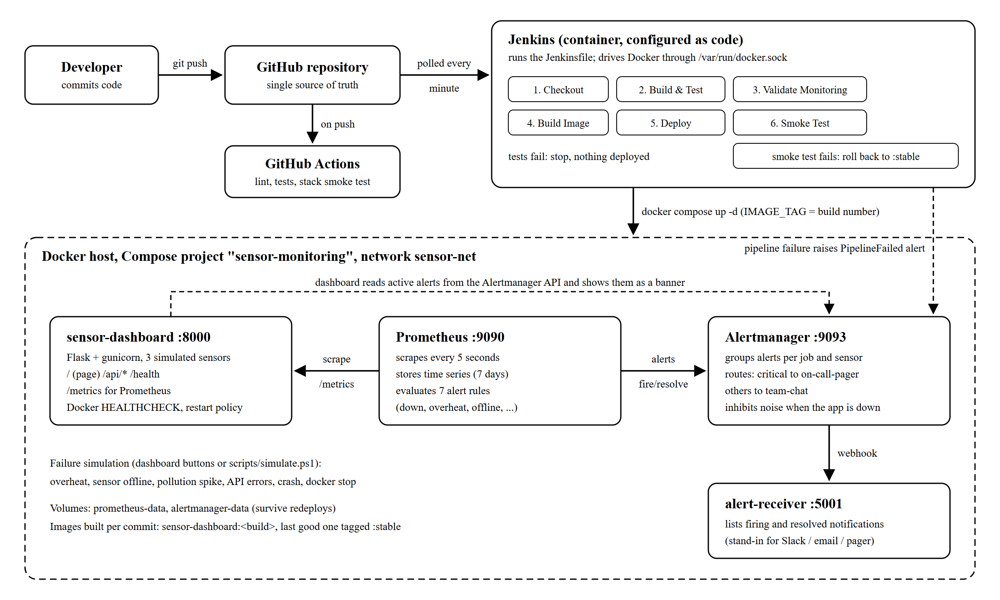

```{=openxml}
<w:p><w:r><w:br w:type="page"/></w:r></w:p>
<w:p><w:pPr><w:pStyle w:val="TOCHeading"/></w:pPr><w:r><w:t>Contents</w:t></w:r></w:p>
<w:p><w:r><w:fldChar w:fldCharType="begin" w:dirty="true"/></w:r><w:r><w:instrText xml:space="preserve"> TOC \o "1-2" \h \z \u </w:instrText></w:r><w:r><w:fldChar w:fldCharType="separate"/></w:r><w:r><w:t>Right-click and choose Update Field to show the contents.</w:t></w:r><w:r><w:fldChar w:fldCharType="end"/></w:r></w:p>
<w:p><w:r><w:br w:type="page"/></w:r></w:p>
```

# 1. Abstract

We built a small web application, an environmental sensor dashboard, and
automated everything that happens to it after a developer commits code.
Jenkins picks up every push to GitHub, runs the unit tests inside a Docker
container, checks the monitoring configuration, builds a new image, deploys
it with Docker Compose and smoke-tests the result. If a test fails, nothing
is deployed. If the smoke test fails, the previous working image is put back
automatically.

Prometheus watches the running system. It scrapes the application every five
seconds and evaluates seven alert rules. Alertmanager groups and routes the
alerts and sends them to a small webhook receiver that stands in for Slack or
email, and failed pipeline runs are reported through the same channel.

We tested the whole loop with real failures: overheating and offline
sensors, a pollution spike, an API returning errors, a crashed process, a
stopped container, a commit with a broken test, and a release that fails its
health check. Every one was either blocked before deployment or detected and
reported within about 30 to 50 seconds, and each alert was marked resolved
once the problem was fixed.

The source code is at <https://github.com/Yashvi2874/DevOps_failure_monitoring>.

# 2. Introduction

## 2.1 Background

DevOps closes the gap between writing code and running it. Instead of a
person copying files to a server and hoping nothing breaks, the steps from
commit to production are written down as code and run by machines. The
running system is measured all the time, so problems are found by monitoring
rather than by users.

Our application is deliberately simple: a dashboard that shows temperature,
humidity, CO₂ and PM2.5 readings from three sensors, placed in a lab, a
server room and outdoors. The readings are simulated, because the project is
about the delivery pipeline and the monitoring around the app, not about
sensor hardware. A simple app is also easy to break on purpose.

## 2.2 Problem statement

Without automation, a team keeps running into three problems:

1. Untested code reaches users. Someone forgets to run the tests before
   deploying, and a bug goes live.
2. "It works on my machine." The app behaves differently on the developer's
   laptop, the tester's machine and the server, because each has different
   library versions.
3. Failures are noticed late. A sensor stops reporting or the server room
   overheats, and nobody finds out until someone happens to look.

## 2.3 Objectives

1. Keep all code and configuration in Git, using feature branches.
2. Build the application into a Docker image so it runs the same way
   everywhere.
3. Run automated tests on every change and stop the pipeline if any fail.
4. Deploy automatically with Jenkins, and roll back automatically if the new
   version is unhealthy.
5. Collect metrics from the running app with Prometheus.
6. Write alert rules for application and sensor failures, and deliver the
   alerts through Alertmanager with grouping, routing and noise suppression.
7. Demonstrate each failure scenario and measure how long detection takes.

# 3. Tools and technologies

| Area | Tool and version | Why we used it |
|---|---|---|
| Version control | Git, GitHub | History of every change; Jenkins and GitHub Actions read the code from here |
| Application | Python 3.12, Flask 3.1 [6], gunicorn 23 | A small, readable web stack |
| Metrics library | prometheus_client 0.23 [5] | Publishes the app and sensor metrics in Prometheus format |
| Testing | pytest 8.4, pytest-cov, flake8 7.3, promtool, unittest | Unit tests, coverage, lint, and tests for the alert rules |
| Containers | Docker Engine 29, Docker Compose plugin [4] | Packaging and running all the services |
| CI/CD | Jenkins 2.580.1 LTS with a declarative pipeline [1], Configuration as Code [7] and Job DSL | Runs test, build, deploy and verify on every push |
| CI on GitHub | GitHub Actions [8] | A second, independent check on every push |
| Monitoring | Prometheus 3.13.4 [2] | Pulls metrics and evaluates the alert rules |
| Alerting | Alertmanager 0.34.1 [3] | Grouping, routing, inhibition and delivery of alerts |

# 4. System architecture



The system has two halves.

The delivery half starts with the developer. Code is pushed to GitHub, where
GitHub Actions runs a quick check and Jenkins picks the change up by polling
the repository every minute. Jenkins runs in its own Docker container, with
the Docker command-line tools installed and the host's Docker socket mounted.
So every pipeline step, from building images to running tests and starting
containers, is carried out by the host's Docker engine.

The running half is a Docker Compose project called `sensor-monitoring`,
with four containers on a private network named `sensor-net`:

| Container | Port | Role |
|---|---|---|
| `sensor-dashboard` | 8000 | The Flask app: dashboard page, JSON API, `/health`, `/metrics` |
| `prometheus` | 9090 | Scrapes `/metrics` every 5 seconds, stores the time series, evaluates the alert rules |
| `alertmanager` | 9093 | Receives alerts from Prometheus and Jenkins, groups them and routes them |
| `alert-receiver` | 5001 | Shows every notification Alertmanager delivers |

The containers find each other by service name. Prometheus scrapes
`dashboard:8000`, and the dashboard reads active alerts from
`alertmanager:9093` so it can show them as a banner on the page.

# 5. Implementation

## 5.1 The application

The sensor simulator (`app/sensor_dashboard/sensors.py`) keeps three
sensors, each with its own baseline. Every two seconds each value moves a
little towards its baseline, plus some random noise, so the readings drift
the way real ones do. Each sensor can be switched into a failure scenario:

- overheat, where the temperature climbs towards 45 °C;
- offline, where the sensor stops producing readings and every attempted
  read counts as an error;
- pollution, where CO₂ and PM2.5 climb to unhealthy levels.

The Flask app (`app.py`) serves the dashboard page, which refreshes itself
every two seconds, and a small JSON API. Two more endpoints matter for
operations. `/health` returns the app's status and the build number that is
running; the Jenkins smoke test uses that number to check that the new
version is the one answering. `/metrics` publishes the readings and the
app's own behaviour in Prometheus format:

| Metric | Meaning |
|---|---|
| `sensor_temperature_celsius`, `sensor_humidity_percent`, `sensor_co2_ppm`, `sensor_pm25_ugm3` | Latest reading for each sensor |
| `sensor_last_seen_timestamp_seconds` | When each sensor last reported, used to spot offline sensors |
| `sensor_up`, `sensor_read_errors_total` | Sensor status and failed reads |
| `dashboard_http_requests_total`, `dashboard_http_request_duration_seconds` | Request count and latency per endpoint and status code |
| `dashboard_build_info` | Which build and commit are running |
| `process_start_time_seconds` | When the process started, used to spot restarts |

A failure-simulation panel on the dashboard, and the scripts
`scripts/simulate.ps1` and `simulate.sh`, can trigger each scenario, make
the API return HTTP 500 errors, or crash the app.

## 5.2 Version control workflow

Each feature was developed on its own branch and merged into `main` with a
merge commit, so the history shows where each feature started and ended:
`feature/sensor-simulator`, `feature/dashboard`, `feature/docker`,
`feature/monitoring`, `feature/jenkins-pipeline`, `feature/github-actions`,
and later `fix/pipeline-alerts`. Secrets such as the Jenkins admin password
live in `jenkins/.env`, which `.gitignore` keeps out of the repository.


## 5.3 Containerization

`app/Dockerfile` is a multi-stage build [4]:

```dockerfile
FROM python:3.12-slim AS base      # Python and the runtime libraries
...
FROM base AS test                  # adds pytest and flake8, runs the tests when started
...
FROM base AS runtime               # the image that gets deployed
RUN useradd --create-home --uid 10001 appuser
USER appuser
HEALTHCHECK --interval=10s CMD python -c "import urllib.request; urllib.request.urlopen('http://127.0.0.1:8000/health')"
CMD ["gunicorn", "--bind", "0.0.0.0:8000", "--workers", "1", "--threads", "4", "sensor_dashboard.wsgi:app"]
```

`requirements.txt` is copied and installed before the source code, so Docker
can reuse the cached dependency layer when only the code changes. The
runtime image runs as a non-root user and has a health check, which Docker
uses to mark the container healthy or unhealthy. The Compose file sets
`restart: unless-stopped`, so a crashed container is started again.

The Prometheus and Alertmanager configuration files are copied into small
custom images instead of being mounted from the host. We chose this on
purpose (see section 8): it lets Jenkins deploy the stack even though Jenkins
runs in its own container, and a change to an alert rule is built, tested
and deployed the same way as a change to the code.

## 5.4 CI/CD pipeline (Jenkins)

The pipeline lives in the `Jenkinsfile` at the root of the repository [1]:

| Stage | What it does | If it fails |
|---|---|---|
| Checkout | Fetches the commit and records its hash and message | Not applicable |
| Build & Test | Builds the `test` image and runs flake8 and 23 pytest tests inside a container; publishes the JUnit report | The pipeline stops and nothing is deployed |
| Validate Monitoring | Checks the Prometheus config, runs the alert-rule unit tests, checks the Alertmanager config and its routing, runs the receiver's tests | The pipeline stops |
| Build Image | Builds `sensor-dashboard:<build number>` with the version, commit hash and build number inside | The pipeline stops |
| Deploy | Runs `docker compose up -d` with `IMAGE_TAG=<build number>`; only containers whose image changed are replaced | The pipeline stops |
| Smoke Test | From a throwaway container on `sensor-net`, checks that `/health` is OK and reports this build, that the API returns three sensors, that `/metrics` works and that Prometheus is scraping the new container | `rollback.sh` redeploys `sensor-dashboard:stable` and checks it |

When the smoke test passes, the image is also tagged `sensor-dashboard:stable`,
which marks it as the last good build for future rollbacks. At the end the
pipeline reports its result to Alertmanager. A failed build raises a
`PipelineFailed` alert and the next successful build resolves it, so broken
builds reach the team through the same channel as application failures.

Jenkins is set up entirely from the files in `jenkins/`. The `Dockerfile`
adds the Docker CLI, the Compose plugin and the Jenkins plugins we need.
`casc.yaml`, read by the Configuration as Code plugin [7], creates the admin
user and, through the Job DSL plugin, the `sensor-dashboard-pipeline` job,
which polls GitHub every minute. There is no setup wizard, and the whole CI
server can be rebuilt with one `docker compose up` command.

GitHub Actions (`.github/workflows/ci.yml`) runs lint, the unit tests, the
rule tests and a full-stack smoke test on GitHub's own machines for every
push [8]. It is a second check that does not depend on our laptop.


## 5.5 Monitoring with Prometheus

Prometheus scrapes three targets every five seconds: the dashboard,
Alertmanager and itself [2]. It evaluates the rules in `alert_rules.yml` at
the same interval. Each rule is a PromQL query plus a `for` duration, and the
condition has to hold for that long before the alert fires, so momentary
blips do not raise alerts.

| Alert | Condition | Severity |
|---|---|---|
| `SensorDashboardDown` | `up == 0` for 30 seconds | critical |
| `HighApiErrorRate` | more than 20% of `/api/*` requests return 5xx, for 30 seconds | critical |
| `SensorDashboardRestarted` | `process_start_time_seconds` changed in the last 5 minutes | info |
| `SensorOverheat` | temperature above 35 °C for 15 seconds | warning |
| `SensorOffline` | no reading for more than 10 seconds, for 10 seconds | warning |
| `HighCO2Level` | CO₂ above 1500 ppm for 20 seconds | warning |
| `HighPM25Level` | PM2.5 above 100 µg/m³ for 20 seconds | warning |

The rules have their own unit tests in
`monitoring/prometheus/tests/alert_rules_test.yml`, run with
`promtool test rules`. Each test feeds Prometheus a made-up time series and
checks which alerts are firing at a given moment, including the exact alert
text. One of them checks that a 10-second outage does not page anyone. We
made sure the tests really run by changing one expected value and watching
the test fail.


## 5.6 Alerting with Alertmanager

Alertmanager decides who hears about an alert, when, and how often [3].
Critical alerts go to an `on-call-pager` receiver after 5 seconds, and
everything else goes to `team-chat`. Alerts are grouped by job and sensor,
so a pollution spike on Sensor 3, which raises both `HighCO2Level` and
`HighPM25Level`, arrives as one notification.

Two inhibition rules hold back alerts that only repeat a known problem.
While `SensorDashboardDown` is firing, the app's warning and info alerts are
held back, because they are symptoms of the same outage. An offline sensor's
last temperature is stale, so `SensorOffline` also suppresses
`SensorOverheat` for that sensor. With `send_resolved: true`, a second
message is sent when a problem clears.

Both receivers are webhooks pointing at our `alert-receiver` service, a small
Python program that uses only the standard library. It stores the
notifications and lists them on a web page. A real team would use Slack,
email or a paging service, and only the receiver section of
`alertmanager.yml` would change.

# 6. Testing

| Level | What is tested | Where it runs |
|---|---|---|
| Lint | Code style and simple mistakes (flake8) | Jenkins, GitHub Actions |
| Unit tests (23) | Sensor simulation, failure scenarios, every API endpoint, metrics output, request counting, the simulation switches and alert formatting; coverage is 91% | Jenkins (inside Docker), GitHub Actions |
| Alert rule tests (6 scenarios) | Each alert fires at the right time with the right labels and text, and short blips do not fire | Jenkins, GitHub Actions |
| Config validation | The Prometheus config, the Alertmanager config, and the routing of critical and warning alerts | Jenkins, GitHub Actions |
| Receiver tests (5) | Parsing, formatting, HTML escaping and the HTTP endpoints | Jenkins, GitHub Actions |
| Smoke test | The deployed container is healthy, is the expected build, serves data and is being scraped | Jenkins after every deploy, GitHub Actions |

# 7. Results

## 7.1 Pipeline runs

| Build | Trigger | What we did | Result |
|---|---|---|---|
| 1 | Polling, first commit | Normal run | Passed in 54 seconds; build 1 deployed |
| 2 | Manual | Normal run | Passed in 22 seconds thanks to cached layers; build 2 deployed |
| 3 | Manual, with `SIMULATE_BAD_DEPLOY=true` | Deployed a build whose `/health` returns 503 | The smoke test failed, build 2 was restored and checked automatically, and a `PipelineFailed` alert was sent |
| 4 | Polling, after a push | Normal run | Passed; deployed within a minute of the push |
| 5 | Polling, after a push | Pushed a commit with a deliberately failing test | Stopped at Build & Test (1 failed, 22 passed); the next four stages were skipped; build 4 stayed live; a `PipelineFailed` alert was sent |
| 6 | Polling, after a push | Reverted the bad test | Passed; build 6 deployed and `PipelineFailed` resolved ("Pipeline is green again") |

Builds 7 to 14 deployed later changes to the documentation and the code
comments, and all of them passed except build 8.


GitHub Actions passed or failed the same commits on its own:


## 7.2 Failure detection

The times below run from triggering the failure to the notification
appearing in the alert receiver.

| Scenario | Alert | Channel | Time to notify |
|---|---|---|---|
| Sensor 1 overheats | `SensorOverheat` | team-chat | 30 to 41 seconds |
| Sensor 2 goes offline | `SensorOffline` | team-chat | 30 seconds |
| Pollution spike on Sensor 3 | `HighCO2Level` and `HighPM25Level`, in one notification | team-chat | about 45 seconds |
| API returns HTTP 500 | `HighApiErrorRate` | on-call-pager | 53 seconds |
| App process crashes | Docker restarts it; `SensorDashboardRestarted` | team-chat | 10 seconds |
| Container stopped | `SensorDashboardDown`, with the restart alert inhibited | on-call-pager | 44 to 48 seconds |
| Container started again | `SensorDashboardDown` resolved | on-call-pager | 24 to 29 seconds |

Each delay is the scrape interval (5 seconds), plus the rule's `for`
duration (10 to 30 seconds), plus the evaluation interval (5 seconds), plus
Alertmanager's `group_wait` (5 seconds). Shorter durations would notify
faster, but they would also fire on harmless blips. These values suit a
demonstration while still filtering out one-off spikes.


# 8. Challenges and how we solved them

1. Deploying from inside a Jenkins container. Our first plan was to mount
   `prometheus.yml` into the Prometheus container from the project folder.
   That fails when Jenkins runs the deployment, because Jenkins's workspace
   is inside the Jenkins container and the host's Docker engine cannot see
   that path. We copied the config files into small custom images instead,
   which also sends config changes through the same pipeline as code.
2. Docker socket permissions. Inside the Jenkins container the socket
   belongs to the root group, so the `jenkins` user could not use it. We
   added that group to the container with `group_add` instead of running
   Jenkins as root. The group id is a setting, because it differs on Linux
   hosts.
3. Alertmanager remembers what it sent. When we restarted Alertmanager in the
   middle of an active alert, it treated the same alert as already delivered
   and stayed silent. We now redeploy Alertmanager only when its
   configuration changes, and the troubleshooting guide mentions this.
4. Everything restarted on the first Jenkins deploy. We had first started
   the stack from our own working copy. The images Jenkins built from its
   checkout were not byte-for-byte the same (different line endings and file
   timestamps), so Compose replaced every container once. After that, only
   services whose image really changed were replaced. We also added a
   `.gitattributes` file so shell scripts and configs keep Unix (LF) line
   endings, because a script with Windows line endings fails on Linux.
5. Port clash. Port 8080 was already used by another program on our machine,
   so the Jenkins port can be changed with `JENKINS_PORT`.
6. Tests could not import the app inside the container. pytest, started from
   the container's working directory, did not put that directory on the
   import path. Setting `pythonpath = .` in `setup.cfg` fixed it everywhere.

# 9. Conclusion

The project covers the whole DevOps loop: code, build, test, deploy, monitor
and alert. Every change goes through version control and an automated
pipeline that refuses to deploy untested code and undoes a bad release by
itself. Docker makes the app run the same way on a developer's laptop and on
GitHub's test machines. Prometheus and Alertmanager turned each failure into
a grouped notification within about half a minute and confirmed when it was
fixed. We demonstrated each of these behaviours with a real failure.

# 10. Future scope

- Replace the simulator with real sensors, for example an ESP32 publishing
  over MQTT, without changing the pipeline or the monitoring.
- Add Grafana dashboards on top of Prometheus for long-term trends.
- Send notifications to Slack, email or Telegram by editing the
  Alertmanager receivers.
- Deploy to a cloud server such as Linode over SSH, pushing images to a
  private registry such as Nexus instead of building on the target machine.
- Use a GitHub webhook, through a public Jenkins URL, instead of polling.
- Run Jenkins builds on separate agents instead of the controller, and move
  to Kubernetes for rolling updates without downtime.

# 11. References

1. Jenkins project. *Pipeline* (Jenkins user handbook). <https://www.jenkins.io/doc/book/pipeline/>
2. Prometheus Authors. *Prometheus documentation: configuration, alerting rules and unit testing.* <https://prometheus.io/docs/>
3. Prometheus Authors. *Alertmanager: routing, grouping and inhibition.* <https://prometheus.io/docs/alerting/latest/alertmanager/>
4. Docker Inc. *Multi-stage builds.* <https://docs.docker.com/build/building/multi-stage/>
5. Prometheus Authors. *Prometheus instrumentation library for Python (prometheus_client).* <https://github.com/prometheus/client_python>
6. Pallets. *Flask documentation.* <https://flask.palletsprojects.com/>
7. Jenkins project. *Configuration as Code plugin.* <https://plugins.jenkins.io/configuration-as-code/>
8. GitHub. *GitHub Actions documentation.* <https://docs.github.com/en/actions>
